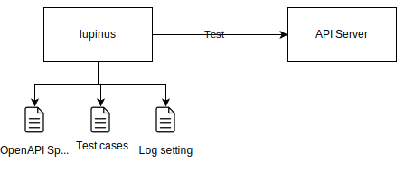

<div align="center">
    <div>
        <picture>
            <source media="(prefers-color-scheme: dark)" srcset="https://github.com/mill6-plat6aux/lupinus/raw/main/images/title-w.png"/>
            
        </picture>
    </div>
    API Server Testing Tool
    <br/><br/><br/>
</div>


I know there are many API testing tools that seem easy to use at first glance, but I honestly don't trust them because they store OpenAPI specifications and authentication information in some online storage without permission 🤢

But what lupinus does is really simple, so please try it 😘


## Architecture



lupinus is an API server testing tool. lupinus reads the OpenAPI specification, calls the APIs in the order described in the test cases, and verifies the normality of their responses. The response is verified for correctness. The verification results can be output to standard output or to an arbitrary file.


## Install

```sh
npm install lupinus
```


## Setting

### API Specification

Use the tool of your choice to create an OpenAPI specification and output it somewhere in YAML or JSON.

### Test cases

In the test case, write in YAML or JSON what order to call the paths described in the OpenAPI specification. Also, write down the expected response.

For example, if you write that you expect HTTP status code 200, lupinus will verify that the data model written in the OpenAPI 200 response is returned.

The string inside the wave brackets will be replaced; the wave brackets in the Authentication header will be Base64-encoded with the user ID and password between the colons. In addition, `context` in the brackets stores the response of the path executed in the previous step. For example, `context[2]` is the response of the third executed path.

```yaml
testCases: 
  - title: "Example"
    contextPath: "https://example.com/path/to"
    sequence: 
      - path: /auth/token
        method: POST
        spec: oauth2.ClientCredentials
        request:
          headers: 
            accept: application/json
            content-type: application/x-www-form-urlencoded
            authorization: Basic {user1:pass1>}
          body:
            grant_type: client_credentials
        response:
          status: 200
      - path: /business/data
        method: GET
        request:
          headers: 
            authorization: Bearer {context[0].access_token}
        response:
          status: 200
```

### Log setting

By default, lupinus will output test results to standard output. If you want to output to a file, write the file path in the `output` attribute.

```yaml
threshold: info
output: result.log
errorOutput: error-result.log
```


## Test

```sh
npx lupinus --spec oas.yaml --testcase testcases.yaml --log log.yaml
```


## License

[MIT](LICENSE)


## Developers

[Takuro Okada](mill6.plat6aux@gmail.com)


---

&copy; Takuro Okada